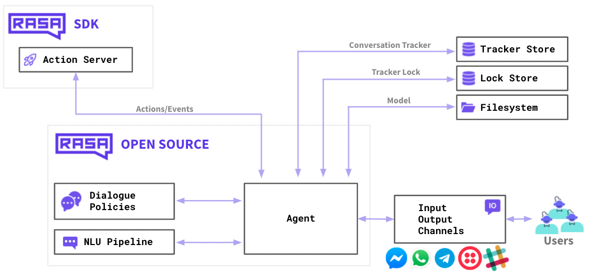

# Hello Rasa

> - <https://github.com/RasaHQ/rasa>
>
> - <https://rasa.com/docs/rasa/>
>
> - <https://learning.rasa.com/conversational-ai-with-rasa/custom-actions/>
>
>   

## setup

```sh
$ pip3 install virtualenv

$ brew info python@3.10

$ virtualenv venv -p python3.10
$ source ./venv/bin/activate
$ python3 --version && pip3 --version

$ pip3 install -U pip && pip3 install rasa

$ rasa --version
Rasa Version      :         3.6.13
Minimum Compatible Version: 3.5.0
Rasa SDK Version  :         3.6.2
Python Version    :         3.10.13
Operating System  :         macOS-13.3-x86_64-i386-64bit
Python Path       :         /Users/hanl5/coding/feuyeux/hello-rasa/venv/bin/python
```

## init

```sh
rasa init
```

## train

```sh
rasa train
```

## run

Terminal 1:

```sh
rasa run actions
```

Terminal 2:

```sh
rasa shell
```
